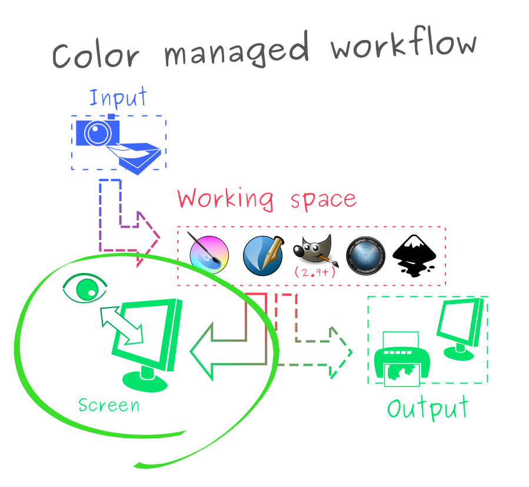

How does DisplayCAL work?
=========================

DisplayCAL's main interface is divided into tabs, each allowing configuration of high-level steps encountered when
working with it.

Calibration
-----------

In DisplayCAL, **calibration** is the process of altering a display panel's available settings to match as best as
possible a set of intended display characteristics (white point, luminance curves,...).

.. note:: Calibration is often colloquially used to refer to the entire process of preparing a display system for
   color-accurate rendering, including measurement and generation of a profiles and their setup in user applications. To
   avoid ambiguity, this may be called **display system calibration**.

   When used in the context of DisplayCAL, calibration only refers to actively altering the display panel as an external
   component, which may be called **display panel calibration**.

Calibration is often done as a first step before profiling, since it helps non-color-managed applications get a
relatively correct rendering even if they will not be fully accurate.

It is typically done through one or more of the following ways:

* **VCGT** (Video Card Gamma Table) is exposed by the OS to provide an approximate calibration when no hardware controls
  exist, by loading 1D curves into the video card. In DisplayCAL, settings in the "Calibration" tab refer to creating
  such a table.

  This option is almost always available on desktop computers ; it is usually good for small adjustments, but larger
  corrections will be heavily affected by compression, quantization or subsampling through the display cable, as well as
  by the limited curve resolution available on the video card itself.

* **OSD** (On-Screen Display) **settings menu** is available on many desktop display panels, usually through control
  knobs and buttons on the side. Depending on the display this may expose more or less settings: some displays provide
  only basic brightness/contrast controls, while others expose full control of the display primaries.

  This much more accurate than using the VCGT, as typically these settings are implemented directly inside the display
  hardware and do not suffer from compression, quantization or subsampling by going through a display cable (e.g. HDMI).

* DDC_/CI is the software equivalent to the OSD, providing interfaces for accessing the display settings in software.
  ddcutil_ is an open-source implementation of this, and may work for your use case.

  This protocol is unfortunately seldom well-supported by open-source tools. It may not expose all the capabilities
  offered by the OSD or the manufacturer software, or may only expose them in private commands that require
  reverse-engineering ; on the other hand, if you're lucky, it might be able to work on displays that don't expose user
  settings through physical buttons.

* **Hardware LUTs** are available only in some very high-end displays, and provide a way for the user to load an
  equivalent of a display profile, so that the display itself can do the color correction without intervention of the
  operating system or application.

  This is by far the most accurate method, but on the other hand is almost only available through the manufacturer's
  software (e.g. EIZO ColorNavigator). There are at the moment no open-source tools that support this feature.

Profiling
---------

**Profiling** is the act of building a **display profile** containing the measured display characteristics.

To display an image or video accurately on a computer display under the ICC_ workflow, you need to know both how the
display behaves (the **display** or **target profile**) and how the image is supposed to be displayed (the **image** or
**source profile**) in order to build a conversion (**link profile**) between the two:

* DisplayCAL and other profiling software are responsible for measuring the actual behavior of a
  computer display into a display profile.

* Images can optionally be tagged with their source profile, in most cases (though not always)
  representing an ideal display on which they are supposed to be displayed ; images with no tags
  usually assume sRGB_.

ICC profiles can be registered with the operating system (on both Windows and Linux), but the
responsibility of actually retrieving and using them properly is entirely delegated to the program
displaying the image.

* Specialized graphics programs (Krita, Inkscape, GIMP, Darktable, Digikam, etc) are usually
  **color-managed**. They can automatically pick up a registered display profile and provide various
  options as to how an image should be rendered using both the image's internal profile and the
  display profile using a **Color Management Module** (CMM).

* Some general-purpose programs (e.g. Firefox, Gwenview, Chrome, the Windows Explorer and Photo
  viewer,...) are **color-aware**, sometimes only partially. They are generally at least aware of
  the image's internal profile, sometimes only for a subset of supported formats, but may ignore the
  registered display profile (defaulting to a common ideal display profile such as sRGB_) or provide
  a limited set of configuration options from their CMM.

* Most programs are by default **color-unaware**, and will ignore both display and image profiles.

.. note:: A common misconception is that profiling should directly change colors on all areas of the display, such as
   for example desktop icons, task bars, etc. It is actually almost never the case on Windows and Linux, as only
   programs that have been built with specific support can take advantage of the generated profile.

3D LUTs
-------

DisplayCAL can also optionally build **3D LUTs**, which can be loaded in programs that support thme (usually for video
editing) to make the display match given characteristics.

In ICC terminology, they're functionally equivalent to pre-rendering a **link profile** between the display profile**
towards a given target profile.

.. _DDC: https://en.wikipedia.org/wiki/Display_Data_Channel
.. _ddcutil: https://www.ddcutil.com/
.. _sRGB: https://en.wikipedia.org/wiki/SRGB
.. _Rec.1886: https://en.wikipedia.org/wiki/ITU-R_BT.1886
.. _Rec.709: https://en.wikipedia.org/wiki/Rec._709
.. _ICC: https://en.wikipedia.org/wiki/ICC_profile
