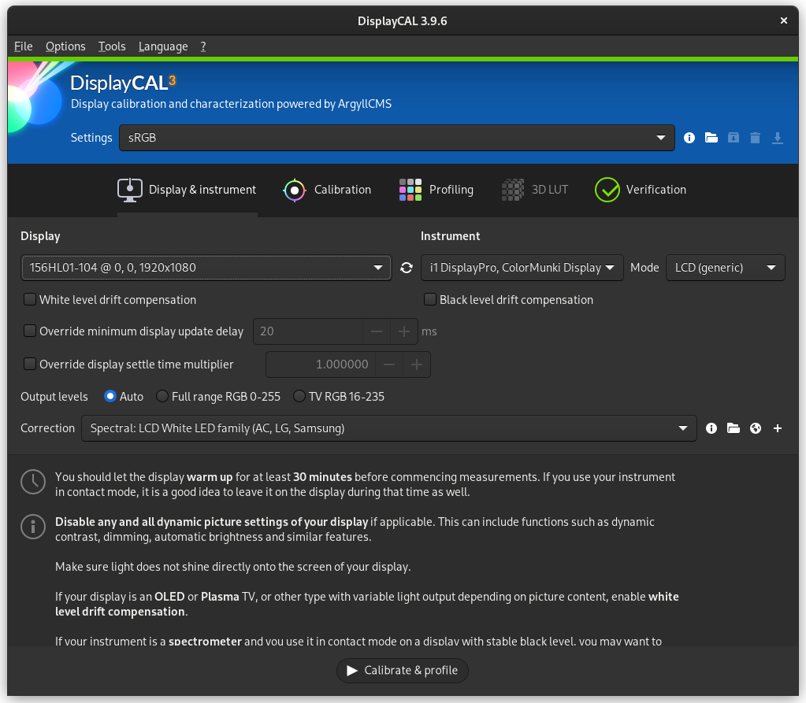

Introduction to DisplayCAL
==========================

DisplayCAL_ is an open-source software that provides a user interface for measuring and
characterizing various types of computer displays, including generation and management of ICC
profiles, as well as generation of 3D LUTs compatible with video editing programs.

DisplayCAL is based on ArgyllCMS_, a collection of command-line tools with the more general purpose
of characterizing all kinds of input and output devices capable of recording or producing colors,
whether analog or digital (displays, cameras, printers, scanners, etc.), but you will in most cases
not need to interact with ArgyllCMS directly.

What is this documentation for?
-------------------------------

I'm writing this documentation in the hopes that it may help newcomers understand how to use DisplayCAL more
effectively.

I'm targeting people who may not be fully familiar with all aspects of how display calibration works, with high-level
explanations on what DisplayCAL aims to achieve, what kind of hardware is available and what tradeoffs are generally
made when choosing a specific type of hardware, as well as step-by-step processes for achieving particular tasks with
DisplayCAL.

It is not at the moment a replacement for DisplayCAL's `reference documentation <https://displaycal.net>`_, and will not
contain an exhaustive explanation of all settings and features. That may become a goal in the future, but is not a
priority for me at the moment.

Do I need DisplayCAL?
---------------------

DisplayCAL is useful for situations where an image needs to be perceived similarly on multiple
surfaces, including rendering of color but also other attributes such as perceived contrast and
brightness. Common scenarios are:

* Displaying images side-by-side on multiple computer displays, for example when comparing similar
  photographs.
* Comparing images between a computer display and printed reproductions using a calibrated or
  profiled printer (generating printer profiles being out of scope for DisplayCAL).

In a lot of cases you do *not* need DisplayCAL for displaying images on a single display. Most
displays are tested for sRGB_ in mind (the standard for images displayed over the internet) ; the
display may be more or less accurate or embed additional rendering tweaks (saturation, contrast,
white point), but outside of extreme cases the differences are almost unnoticeable in day-to-day
usage once your eye is adapted to the display. A few exceptions exist, such as:

* Ensuring rendering of an image is neutral and does not influence perception while editing
  photographs that will be shared over the internet (for example when editing using consumer
  displays or TVs with very opinionated factory renderings showing high saturation/contrast compared
  to sRGB_).
* Ensuring rendering of a video follows a specific standard in order to perform
  color grading (e.g. Rec.1886_ with Rec.709_ primaries).

.. _DisplayCAL: https://displaycal.net/
.. _ArgyllCMS: http://argyllcms.com/
